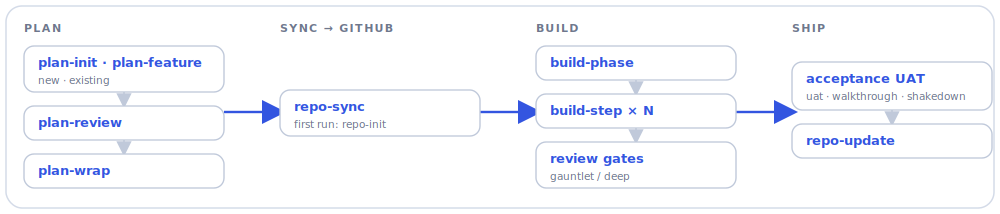

## Abraham Robison

**Applied AI engineer with deep finance roots.** I design and ship agentic, full-stack AI
systems — autonomous, judge-gated, cost-aware — and ground them in real financial work:
treasury, forecasting, portfolio, risk, and valuation.

Currently an **Applied AI Scientist (contract) at FEV**, building AI and data tooling for
private-asset valuation. Previously **Senior Quantitative Analyst, Treasury at Google** and
**Senior Quantitative Research Analyst at Russell Investments**, shipping applied-ML and
forecasting systems into large-scale finance operations.

### What I build

- **Agentic systems & LLM orchestration** — autonomous, judge-gated pipelines with cost ledgers and audit trails
- **Applied ML & forecasting** — self-improving models, closed-loop learning, decision systems
- **End to end** — research → models → data pipelines → UI → production
- **Cost-aware AI** — local-model routing with fail-safe fallback; distillation and efficiency

### Selected projects

- **[Alpha4Gate](https://github.com/aberson/Alpha4Gate)** — a self-improving StarCraft II bot: a Claude-advised loop that reads its own telemetry and auto-commits fixes (gated by tests + validation games), plus a self-play arena with an Elo ladder. *Python, PyTorch/SB3, FastAPI, React.*
- **[toybox](https://github.com/aberson/toybox)** — a local-first home AI: passive listening (VAD + Whisper) → intent detection → a branching activity engine → parent-approval UI → a kids' PWA with generated sprites and on-device TTS. Runs fully offline. *Python/FastAPI + React/TypeScript.*
- **[pta_finance](https://github.com/aberson/pta_finance)** — a production finance toolkit for small nonprofits: Google Sheets as system-of-record, canonical ledger normalization, budget-vs-actual analytics, automated monthly reports. *Python, `mypy --strict`, GitHub Actions.*
- **[shake_spear](https://github.com/aberson/shake_spear)** — a markdown-first creative-writing workshop: a stdlib-only `ss` CLI that scaffolds and manages independent story projects, with AI as coach and continuity assistant. The product is plain-markdown files on disk — no web app, no database, no API. *Python.*
- **[applied_learning](https://github.com/aberson/applied_learning)** — hands-on ML ramps (diffusion, knowledge distillation) with runnable notebooks; distillation tied to real cost reduction. *Jupyter.*
- **[walkies](https://github.com/aberson/walkies)** — a native dog-walking decision app fusing weather, air quality, and pavement temperature into a go/no-go verdict. *React Native, TypeScript.*

### How I build with AI

I treat agent work as a **pipeline with quality gates**: plan one step at a time, build each in
isolation, review with independent adversarial passes, and only then ship. Much of it runs as a
collection of Claude Code skills I use daily — open-sourced below.

<picture>
  <source media="(prefers-color-scheme: dark)" srcset="assets/core-pipeline-dark.svg">
  
</picture>

Several skills use multi-agent fan-out — parallel reviewers, judge panels, and generate-then-grade
loops — so a change clears independent scrutiny before it lands.

→ **[github.com/aberson/claude-skills](https://github.com/aberson/claude-skills)** — the full
collection (planning, building, reviewing, and session tooling), with copy-pasteable workflows.
The same pipeline drives a private, autonomous "issue → merged-PR" factory — happy to walk through it.

### GitHub activity

### Background

10+ years across Google Treasury, Russell Investments, and BlackRock. MA Economics + Graduate
Certificate in Computational Finance (University of Washington); BS Computer Science + BA
Mathematics. Google Cloud Certified — Generative AI Leader.

**Stack:** Python · R · SQL · PyTorch · GCP/Vertex AI · BigQuery · FastAPI · React/TypeScript · Docker

*Bay Area · open to remote and relocation.*
